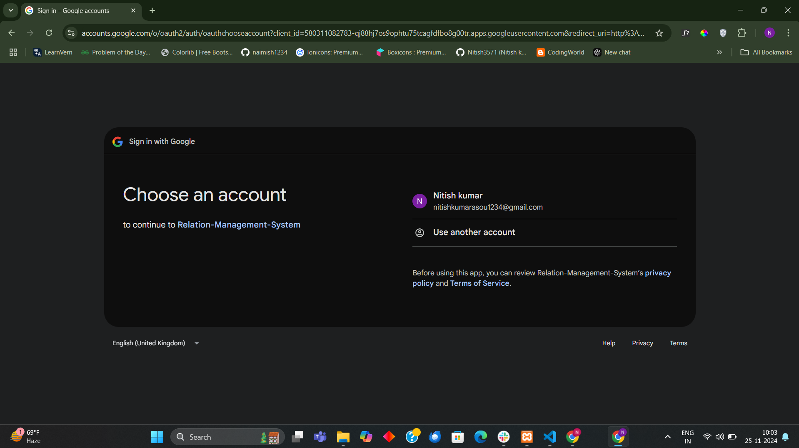
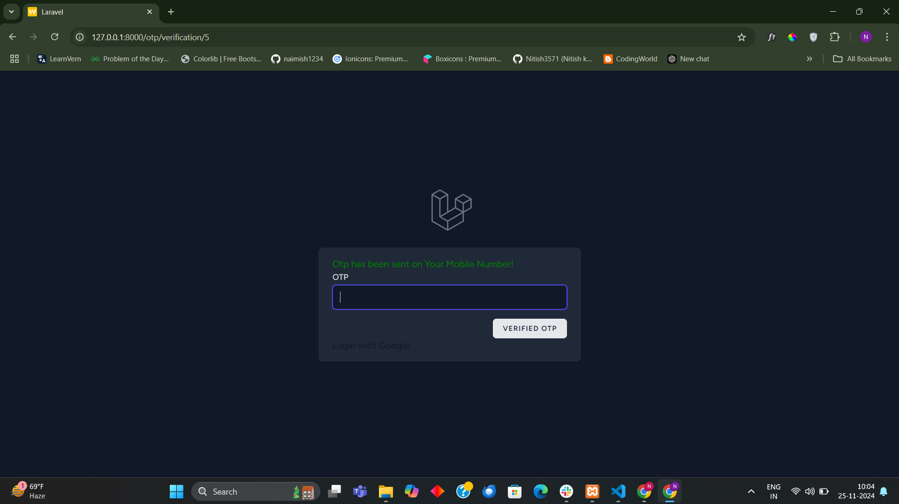
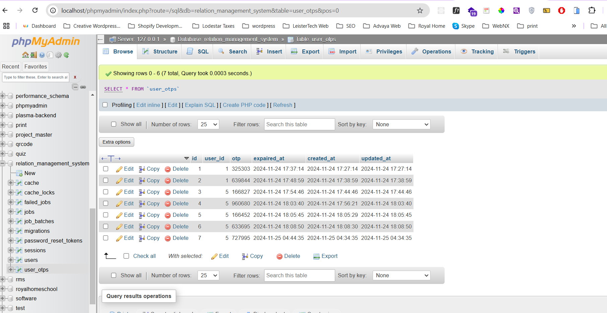
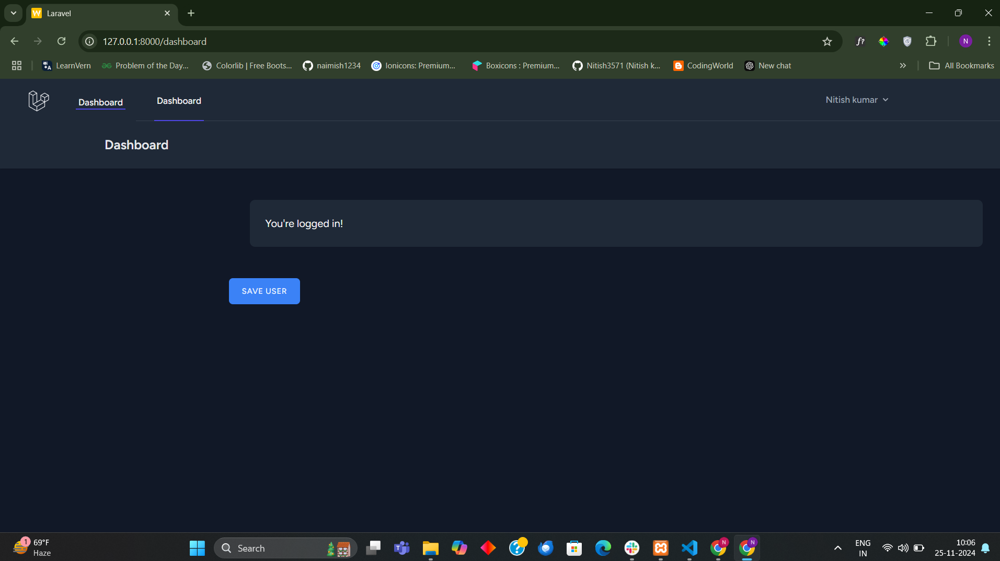

## About Project

Install the latest laravel version
Create Admins table via migration - column(id,'email', 'password',created_at,updated_at)
Create a login page, contains email and password columns.

## Social Login
In this Repo we use Laravel socialite login like google, facebook, githhub.

## OTP Login
We also use twilio for Phone OTP login.

